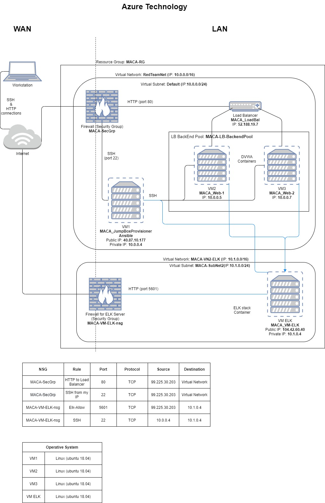
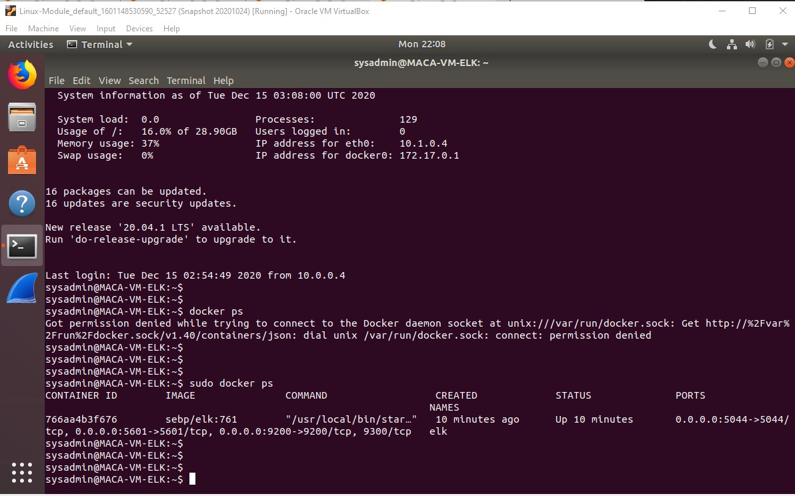
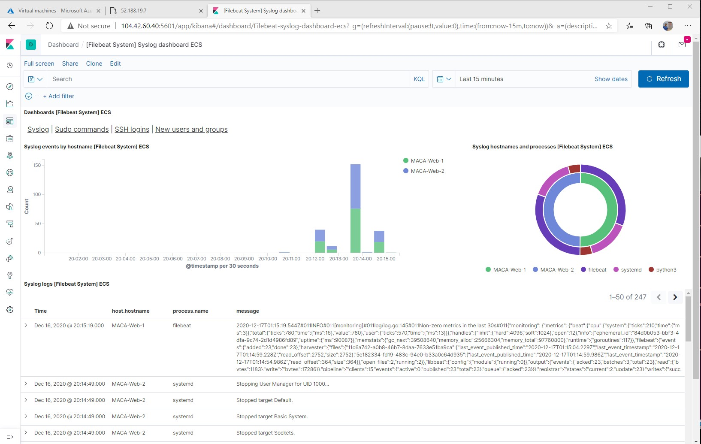
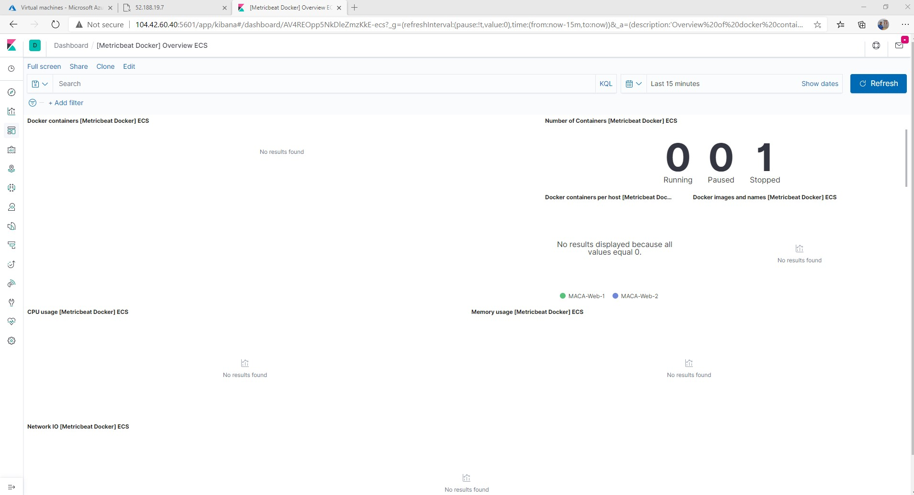

## Automated ELK Stack Deployment

The files in this repository were used to configure the network depicted below.



These files have been tested and used to generate a live ELK deployment on Azure. They can be used to either recreate the entire deployment pictured above. Alternatively, select portions of the __yml__ file (playbook) may be used to install only certain pieces of it, such as Filebeat.

Playbooks to install/deploy on Web servers
  - <TODO> [Install DVWA on Web Servers](Files/my_playbook.yml).
  - <TODO> [Configuration files for Filebeat](Files/filebeat-configuration.yml).
  - <TODO> [Configuration files for Metricbeat](Files/metricbeat-configuration.yml).
  - <TODO> [Install Filebeat on Web Servers](Files/filebeat-playbook.yml).
  - <TODO> [Install Metricbeat on Web Servers](Files/metricbeat-playbook.yml).
  - <TODO> [To start Beat services](Files/start-beatservices-playbook.yml).

Playbooks to install on ELK servers
  - <TODO> [Install ELK on the ELK servers](Files/install-elk.yml).

This document contains the following details:
- Description of the Topology
- Access Policies
- ELK Configuration
  - Beats in Use
  - Machines Being Monitored
- How to Use the Ansible Build


### Description of the Topology

The main purpose of this network is to expose a load-balanced and monitored instance of DVWA (D*mn Vulnerable Web Application).

Load balancing ensures that the application will be in high __availability__, in addition to restricting __the data avoiding to overflow__ the network.

- <TODO> _What aspect of security do load balancers protect? A load balancer ensures no single server has to handle too much traffic._

- <TODO> _What is the advantage of a jump box? A jump box is a server on the network that is used to access other virtual machines in a separete security zone, and, in case of this project, it is configured with a SSH key access. We have the entire network protected not been exposed to internet and only through the jumpbox can be accesible and just the correct users can have access._

Integrating an ELK server allows users to easily monitor the vulnerable VMs for changes to the __services__ and system __logs and files__.

- <TODO> _What does Filebeat watch for? Filebeat logs information about the file system, including which files have changed and when. Filebeat can be classified as 'Log Management' tool._

- <TODO> _What does Metricbeat record? Metricbeat collects machine metrics and stadistis from the systems and services. Metricbeat can be classified as 'Monitoring' tool._

The configuration details of each machine may be found below.

| Name                      | Function | IP Address | Operating System |
|---------------------------|----------|------------|------------------|
| MACA_Jump_Box_Provisioner | Gateway  | 10.0.0.4 (40.87.10.177)  | Linux 18.04 LTS  |
| MACA_Web-1            | Client VM    | 10.0.0.5   | Linux 18.04 LTS  |
| MACA_Web-2            | Client VM    | 10.0.0.7   | Linux 18.04 LTS  |
| MACA_VM-ELK           | IPS          | 10.1.0.4 (104.4260.40)  | Linux 18.04 LTS  |

### Access Policies

The machines on the internal network are not exposed to the public Internet. 

Only the __MACA_Jump_Box_Provisioner__ machine can accept connections from the Internet. Access to this machine is only allowed from the following IP addresses:

- <TODO> _Whitelisted IP addresses  99.225.30.203_

Machines within the network can only be accessed by __SSH connection from the Ansible Provisioner VM to be configured__.

- <TODO> _Which machine did you allow to access your ELK VM? What was its IP address? In order to configure ELK server (10.1.0.4) the access is only from the jumpbox server using  private IP 10.0.0.4. To analyse the logs/metrics the access is only with TCP connection from my workstation with my public IP to ELK public IP (104.42.60.40)_


A summary of the access policies in place can be found in the table below.

<TODO>

| Name     | Publicly Accessible| Allowed IP Addresses      |
|----------|--------------------|---------------------------|
| Jump Box | Yes                | 99.225.30.203             |
| ELK      | Yes                | 99.225.30.203, 10.0.0.4   |
| Web1     | No                 | 52.188.19.7, 10.0.0.4     |
| Web2     | No                 | 52.188.19.7, 10.0.0.4     |


### Elk Configuration

Ansible was used to automate configuration of the ELK machine. No configuration was performed manually, which is advantageous because...

- <TODO> _What is the main advantage of automating configuration with Ansible? Now we can install and configure everything at once and in all the serves (containers) using Ansible, before this technology, each task had to be done manually on each virtual machine, spending not only more time and resources but with highly probability of human error._

The playbook implements the following tasks:
- <TODO> _Steps of the ELK installation play. E.g., install Docker; download image; etc._

  * __Install docker.io,__ it uses _update-cache=yes_ because is necesary to download and install _docker.io_, this is the equivalent of running _apt update_
  * __Install python3-pip,__ it will install python version 3 and will default to p3p.
  * __Install Docker module,__ docker will be installed so Ansible can utilize that module to control docker containers.
  * __Increase virtual memory,__ it is used to increase the memory that is a requirement for ELK.
  * __Use more memory,__ it will use the memory configured to be used by ELK.
  * __Download and launch a docker elk container,__ it will donwload the image of ELK container under specific ports.


The following screenshot displays the result of running `docker ps` after successfully configuring the ELK instance (it should run with _sudo_).



### Target Machines & Beats
This ELK server is configured to monitor the following machines:
<TODO>
- _MACA_Web-1 `(10.0.0.5)`_
- _MACA_Web-2 `(10.0.0.7)`_


**Beats Installed**

Generally, the beats family are open-source lightweight data shippers that are installed as **agents** on the servers to send operational data to Elasticsearch. Beats can send data directly to Elasticsearch. The beats Family consists of Filebeat, Metricbeat, Packetbeat, Winlogbeat, Auditbeat, Journalbeat, Heartbeat and Functionbeat.

We have installed the following Beats on these machines:
<TODO> 
- __FileBeat__
- __Metricbeat__

These Beats allow us to collect the following information from each machine:

- <TODO> _FileBeat_ is designed to ship log files, and helps to keep things simple by offering a lightweight way (low memory footprint) to forward and centralize logs and files.

- <TODO> _MetricBeat_ ships host metrics, it is a lightweight agent installed on target servers to periodically collect metric data from the target servers, this could be operating system metrics such as CPU or memory or data related to services running on the server. It can also be used to monitor other beats and ELK stack itself..

### Using the Playbook
In order to use the playbook, you will need to have an Ansible control node already configured. Assuming you have such a control node provisioned: 

<TODO>

SSH into the control node and follow the steps below:
- Copy the __filebeat-playbook.yml__ file to __/etc/ansible/roles__.
- Update the __hosts__ file to include __the IPs of the Web Servers including the instruction _'ansible_python_interpreter=/usr/bin/python3'_ to configure the correct version of python, also update the 'ansible.cfg' file to add the remote_user configured in the VM__
- Run the playbook, and navigate to __http://%%ELK-Public-IP%%:5601/app/kibana__ to check that the installation worked as expected.

<TODO> Answering with more detail
- _Which file is the playbook?_  
  __filebeat-playbook.yml__ 

- _Where do you copy it?_  
  __It is copied to /etc/ansible/roles, the folder 'roles' was created to have more organization of the yml files created__

- _Which file do you update to make Ansible run the playbook on a specific machine?_  
  __The _host_ file.__

- _How do I specify which machine to install the ELK server on versus which to install Filebeat on?_  
  __Updating the 'hosts' file with the creation of groups, each host group will have only the IP addressess that are requiered to install, and updating the header on the yml file under the section 'hosts' with the correct host group that will contains the IP group where will run the playbook__
- _Which URL do you navigate to in order to check that the ELK server is running?_  
  __http://104.42.60.40:5601/app/kibana (This is the public IP address asigned to ELK server)__

_As a **Bonus**, next are the commands the user will need to run to download the playbook, update the files, etc._

The next are the steps to install ELK, but (at least for this project) first we just need to be sure of:
- A New Vitual Network is created with a Peer connection between both Virtual Networks.
- Created a Virtual Machine with at least 4GB of RAM and public IP, also copied from the ansible container the SSH key and added to the new VM as SSH public Key.

Once the previous steps are done, follow the next to install ELK:

1. Add the new VM to the Ansible 'hosts' file (create a new host group with this new IP)
2. Create a new Ansible playbook for the new ELK VM, use the same uer configured in the new virtual machine.

```bash
- name: Config elk VM with Docker
  hosts: elk
  remote_user: sysadmin
  become: true
  tasks:
```

3. Increase the memory as system requirement

```
- name: Use more memory
  sysctl:
    name: vm.max_map_count
    value: '262144'
    state: present
    reload: yes
```

4. Install docker.io

```
- name: Install docker.io
  apt:
    update_cache: yes
    name: docker.io
    state: present
```

5. Install python3

```
- name: Install pip3
  apt:
    force_apt_get: yes
    name: python3-pip
    state: present
```

6. Install docker 

```
- name: Install Docker python module
  pip:
    name: docker
    state: present
```

7.  Once the docker is configured to be installed, configure the playbook to download _sebp/el:761_ image container with ports:

```
- name: download and launch a docker elk container
  docker_container:
    name: elk
    image: sebp/elk:761
    state: started
    restart_policy: always
    published_ports:
      - 5601:5601
      - 9200:9200
      - 5044:5044
```

8. From the Ansible container, do a SSH connection to the ELK server to verify the connection before run the playbook.

9. Run the ansible playbook with the next command and be sure any error is presented
```
root@cee814e280aa:/etc/ansible/roles# ansible-playbook install-elk.yml  
```

10. SSH to the container (ELK server) to verify _elk-docker_ container is running
```
sysadmin@MACA_VM-ELK:~$sudo docker ps
```

11. Verify ELK stack from  the browser
    http://[your.VM.IP]:5601/app/kibana


Once the ELK server is installed, then we need to install _beats_

12. To install _filebeat_, we just need to follow the steps that are already on kibana, the next PDF, contains the steps that we can find there:

    [<TODO> File with the steps to install filebeat](Files/TutorialKibanaSystemLogs.pdf)

- The changes to be done are:

  Edit the file to include the ELK server's IP address.
```bash
output.elasticsearch:
hosts: ["10.1.0.4:9200"]
username: "elastic"
password: "changeme"
..
...
..
setup.kibana:
host: "10.1.0.4:5601"
```

  Save this file in  `/etc/ansible/files/filebeat-configuration.yml`.

  - <TODO> [Configuration Filebeat file](Files/filebeat-configuration.yml).
  - <TODO> [Install Playbook Filebeat file](Files/filebeat-playbook.yml).




13. To install _metricbeat_, the steps are similar to the previos instalation, just follow the steps that are already on kibana, the next PDF, contains the steps that we can find there:


    [<TODO> File with the steps to install filebeat](Files/TutorialKibanaDockerMetrics.pdf)

  Save the file configuration in  `/etc/ansible/files/metricbeat-configuration.yml`.

<TODO> [Configuration Metricbeat file](Files/metricbeat-configuration.yml).

<TODO> [Install Playbook Metricbeat file](Files/metricbeat-playbook.yml).

<TODO> 


Done!

__MACA__
