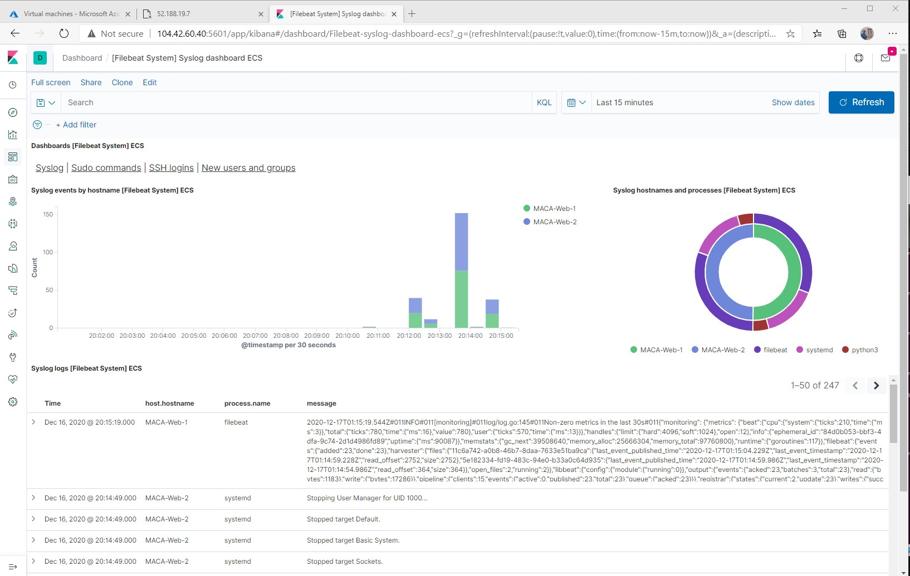
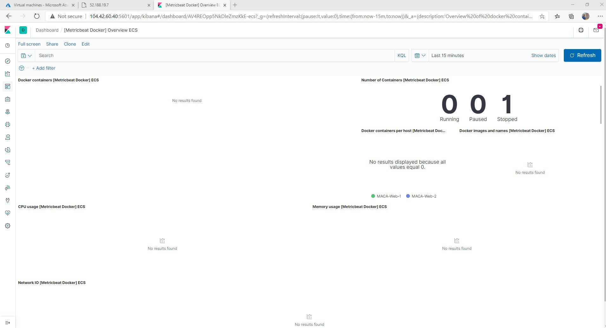

## Automated ELK Stack Deployment

The files in this repository were used to configure the network depicted below.


These files have been tested and used to generate a live ELK deployment on Azure. They can be used to either recreate the entire deployment pictured above. Alternatively, select portions of the __yml__ file (playbook) may be used to install only certain pieces of it, such as Filebeat.

Playbooks to install/deploy Web servers
  - __TODO:__ - [Install DVWA on the Web Servers](Files/my_playbook.yml).
  - __TODO:__ - [Install ELK on the Web servers](Files/install-elk.yml).
  - __TODO:__ - [To start Beat services](Files/start-beatservices-playbook.yml).

Playbooks to install ELK servers
  - __TODO:__ - [Install Filebeat](Files/filebeat-playbook.yml).
  - __TODO:__ - [Install Metricbeat](Files/metricbeat-playbook.yml).

This document contains the following details:
- Description of the Topology
- Access Policies
- ELK Configuration
  - Beats in Use
  - Machines Being Monitored
- How to Use the Ansible Build


### Description of the Topology

The main purpose of this network is to expose a load-balanced and monitored instance of DVWA (D*mn Vulnerable Web Application).

Load balancing ensures that the application will be highly __availability__, in addition to restricting __the data to avoid overflowing__ the network.

- __TODO:__ _What aspect of security do load balancers protect? A load balancer ensures no single server has to handle too much traffic._

- __TODO:__ _What is the advantage of a jump box? A jump box is a server on the network that is used to access other virtual machines in a separete security zone, and, in case of this project, it is configured with a SSH key access. We have the entire network protected not been exposed to internet and only through the jumpbox can be accesible and just the correct users can have access._

Integrating an ELK server allows users to easily monitor the vulnerable VMs for changes to the __services__ and system __logs and files__.

- __TODO:__ _What does Filebeat watch for? Filebeat logs information about the file system, including which files have changed and when. Filebeat can be classified as 'Log Management' tool._

- __TODO:__ _What does Metricbeat record? Metricbeat collects machine metrics and stadistis from the systems and services. Metricbeat can be classified as 'Monitoring' tool._

The configuration details of each machine may be found below.

| Name                      | Function | IP Address | Operating System |
|---------------------------|----------|------------|------------------|
| MACA_Jump_Box_Provisioner | Gateway  | 10.0.0.4 (40.87.10.177)  | Linux 18.04 LTS  |
| MACA_Web-1            | Client VM    | 10.0.0.5   | Linux 18.04 LTS  |
| MACA_Web-2            | Client VM    | 10.0.0.7   | Linux 18.04 LTS  |
| MACA_VM-ELK           | IPS          | 10.1.0.4 (104.4260.40)  | Linux 18.04 LTS  |

### Access Policies

The machines on the internal network are not exposed to the public Internet. 

Only the __MACA_Jump_Box_Provisioner__ machine can accept connections from the Internet. Access to this machine is only allowed from the following IP addresses:
- __TODO:__ _Whitelisted IP addresses  99.225.30.203_

Machines within the network can only be accessed by __SSH connection from the Ansible Provisioner VM to be configured__.

- __TODO:__ _Which machine did you allow to access your ELK VM? What was its IP address? To configure the ELK server (10.1.0.4) the access is only from the  jumpbox with private IP 10.0.0.4. To analyse the logs/metrics the access is only TCP connection from my workstation with my public IP to ELK public IP (104.42.60.40)_


A summary of the access policies in place can be found in the table below.

__TODO__

| Name     | Publicly Accessible | Allowed IP Addresses    |
|----------|-------------------|---------------------------|
| Jump Box | Yes               | 99.225.30.203             |
| ELK      | Yes               | 99.225.30.203, 10.0.0.4   |
| Web1     | No                | 52.188.19.7, 10.0.0.4     |
| Web2     | No                | 52.188.19.7, 10.0.0.4     |


### Elk Configuration

Ansible was used to automate configuration of the ELK machine. No configuration was performed manually, which is advantageous because...
- __TODO:__ _What is the main advantage of automating configuration with Ansible? Now we can install and configure everything at once and in all the containers using Ansible, before each task had to be done manually and on each virtual machine, spending more time, resources and high probability of human error._

The playbook implements the following tasks:
- __TODO:__ _In 3-5 bullets, explain the steps of the ELK installation play. E.g., install Docker; download image; etc._

  * Install docker.io, it use update-cache=yes because is used to download and install docker.io this is the equivalent of running _apt update_
  * Install python3-pip, it will install python 3 and will default to p3p.
  * Install Docker module, docker will be installed so Ansible can utilize that module to control docker containers 
  * Increase virtual memory, it used to increase the memory that is a requirement of ELK.
  * Use more memory
  * Download and launch a docker elk container, it will donwload the image of ELK container under specific ports.


  * Install docker.io
    * The steps used for this task are: update_cache=yes, force_apt_get, name=docker.io, state=present, it 
  * Install python3-pip
    * The steps are: force_apt_get=yes, namepython3-pip, state=present
  * Install Docker module
    * The steps are: name, state
  * Increase virtual memory
    * The steps are: command
  * Use more memory
      * The steps are: name, value, state, reload
  * Download and launch a docker elk container
    * The steps are: name, image, state, restart_policy, published_ports


The following screenshot displays the result of running `docker ps` after successfully configuring the ELK instance.


### Target Machines & Beats
This ELK server is configured to monitor the following machines:
- __TODO:__
- _`MACA_Web-1` (10.0.0.5)_
- _`MACA_Web-2` (10.0.0.7)_

We have installed the following Beats on these machines:
- __TODO:__ 
- _`FileBeat`_
- _`Metricbeat`_

These Beats allow us to collect the following information from each machine:
- __TODO:***__ _In 1-2 sentences, explain what kind of data each beat collects, and provide 1 example of what you expect to see. E.g., `Winlogbeat` collects Windows logs, which we use to track user logon events, etc._

- `SSH Login` collect data of all attempted connections using SSH procotol, we can track any access successed or failed to the system.

### Using the Playbook
In order to use the playbook, you will need to have an Ansible control node already configured. Assuming you have such a control node provisioned: 

__TODO__

SSH into the control node and follow the steps below:
- Copy the __filebeat-playbook.yml__ file to __/etc/ansible/files__.
- Update the __host__ file to include __the IPs of the Web Servers including the instrucion _'ansible_python_interpreter=/usr/bin/python3'_ to configure the correct python verion, also update the 'ansible.cfg' file to add the remote_user configured in the VM__
- Run the playbook, and navigate to __http://<ELK-Public-IP>:5601/app/kibana__ to check that the installation worked as expected.

__TODO:__ _Answer the following questions_
- _Which file is the playbook?_
  __filebeat-playbook.yml__ 
- _Where do you copy it?_
  __It is copied /etc/ansible/files__
- _Which file do you update to make Ansible run the playbook on a specific machine?_
  __The _host_ file.__
- _How do I specify which machine to install the ELK server on versus which to install Filebeat on?_
  __Updating the 'host' file with the creation of groups, each host group will have only the IP addressess that I need to install and updating header on the yml file under the section 'hosts' with the correct host group that will contains the IP group where will be run the playbook__
- _Which URL do you navigate to in order to check that the ELK server is running?_
  __http://104.42.60.40:5601/app/kibana (This is the public IP address of the ELK server)__

_As a **Bonus**, provide the specific commands the user will need to run to download the playbook, update the files, etc._

The next are the steps to install ELK, but first we just need to be sure of:
- A New Vitual Network is created with a Peer connection between both Virtual Networks.
- Created a Virtual Machine with at least 4GB of RAM and public IP, also copied from the ansible container the SSH key and added to the new VM as SSH public Key.

Once the previous steps are done, follow the next to install:

1. Add the new VM to the Ansible 'hosts' file (create a new host group with this new IP)
2. Create a new Ansible playbook for the new ELK VM, use the same uer configured in the new virtual machine.

```bash
- name: Config elk VM with Docker
  hosts: elk
  remote_user: sysadmin
  become: true
  tasks:
```

3. Increase the memory as system requirement

```
- name: Use more memory
  sysctl:
    name: vm.max_map_count
    value: '262144'
    state: present
    reload: yes
```

4. Install docker.io

```
- name: Install docker.io
  apt:
    update_cache: yes
    name: docker.io
    state: present
```

5. Install python3

```
- name: Install pip3
  apt:
    force_apt_get: yes
    name: python3-pip
    state: present
```

6. Install docker 

```
- name: Install Docker python module
  pip:
    name: docker
    state: present
```

7.  Once the docker is configured to be installed, configure the playbook to download _sebp/el:761_ container with the next ports:

```
- name: download and launch a docker elk container
  docker_container:
    name: elk
    image: sebp/elk:761
    state: started
    restart_policy: always
    published_ports:
      - 5601:5601
      - 9200:9200
      - 5044:5044
```

8. From the Ansible container, do a SSH connection to the ELK server to verify the connection before run the playbook.

9. Run the ansible playbook with the next command and be sure any error is presented
```
root@cee814e280aa:/etc/ansible/roles# ansible-playbook install-elk.yml  
```

10. SSH to the container (ELK server) to verify _elk-docker_ container is running
```
sysadmin@MACA_VM-ELK:~$sudo docker ps
```

11. Verify ELK stack from  the browser
    http://[your.VM.IP]:5601/app/kibana


Once the ELK server is installed, then we ned to install the _beats_

12. To install _filebeat_, we just need to follow the steps that are already on kibana, the next PDF, contains the steps that we can find there:

    [TODO: File with the steps to install filebeat](Files/TutorialKibanaSystemLogs.pdf)

- The changes to be done on this file:

  Edit the file to include the ELK server's IP address.
```bash
output.elasticsearch:
hosts: ["10.1.0.4:9200"]
username: "elastic"
password: "changeme"
...
setup.kibana:
host: "10.1.0.4:5601"
```

  Save this file in  `/etc/ansible/files/filebeat-config.yml`.

  __TODO:__ - [Install Filebeat file](Files/install-filebeat.yml).




13. To install _metricbeat_, the steps are similar to the previos instalation, follow the steps that are already on kibana, the next PDF, contains the steps that we can find there:


    [__TODO:__ File with the steps to install filebeat](Files/TutorialKibanaDockerMetrics.pdf)

    [__TODO:__ Install Metricbeat](Files/metricbeat-configuration.yml).

    [__TODO:__ Playbook Metricbeat](Files/metricbeat-playbook.yml).

__TODO:__ 


